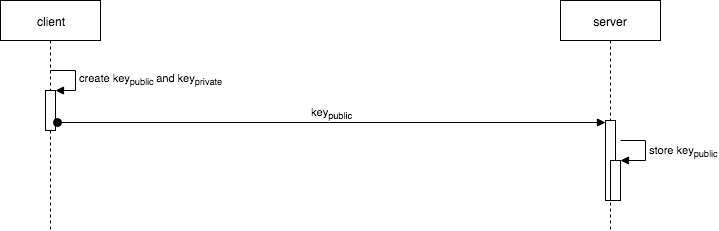

`my.bioMetrics.createKey` là API tạo ra cặp public và private key RSA 2048, được lưu trữ vào keychain của ios hoặc keystore của android. Private key này sẽ dùng để encrypt data như flow. Public key dùng để gửi lên server, server sẽ dùng public key để decrypt data mà client gửi lên.



**Lưu ý:**

- Việc lưu trữ cặp key này đòi hỏi thiết bị phải có sensor của bio metrics và đã cài đặt sẵn 1 trong face id, touch id hoặc móng mắt... Sử dụng JSAPI [my.bioMetrics.isSupported](./is-supported) để kiểm tra việc này.
- Khi gọi JSAPI này, các key được tạo ra trước đó sẽ bị xoá đi. Client phải gửi lại public key lên server để update lại public key.
- Do cặp key này được lưu trữ bảo mật, nên muốn lấy ra cần phải dùng biometrics để xác thực trước.

## Quét mã để trải nghiệm

import { QRCode } from '@site/src/components/QRCode';

<QRCode page="pages/api/bio-metrics/server/index" />

## Demo

import { Simulator } from '@site/src/components/Simulator';

<Simulator page="pages/api/bio-metrics/server/index" />

**_Khả dụng_**: Hỗ trợ từ version 1.96.7 trở lên.

## API Params

| Thuộc tính | Kiểu dữ liệu | Mô tả                                            |
| ---------- | ------------ | ------------------------------------------------ |
| success    | Function     | Callback function khi việc tạo key thành công    |
| fail       | Function     | Callback function khi việc tạo key thất bại      |
| complete   | Function     | Callback function bất kể thành công hay thất bại |

## Giá trị trong success callback

Khi việc gọi API thành công, framework sẽ trả về payload chứa các thông tin sau

| Thuộc tính | Kiểu dữ liệu | Mô tả                             |
| ---------- | ------------ | --------------------------------- |
| publicKey  | String       | Public key được lưu ở dưới device |

### Sample Code

```xml title=index.xml
<view>
  <block-header title="Usage" description="Use Biometrics to authenticate with server" />
  <view class="block-content">
    <view class="page-section-btns">
      <button type="primary" onTap="createKey">Create Key Pair</button>
      <button type="primary" onTap="keyExists">Check Key Exists</button>
      <button type="primary" onTap="deleteKey">Delete Key</button>
    </view>
  </view>
  <view class="block-content">
    <view class="page-section-btns">
      <button type="primary" onTap="createSignature">Generate Signature</button>
    </view>
  </view>
</view>
```

```js title=index.js
Page({
  createKey() {
    my.bioMetrics.createKey({
      success: ({ publicKey }) => {
        my.alert({
          title: 'Success',
          content: `Public Key:${publicKey}`
        });
      },
      fail: (res) => {
        my.alert({ title: 'Fail', content: JSON.stringify(res) });
      }
    });
  }
});
```
