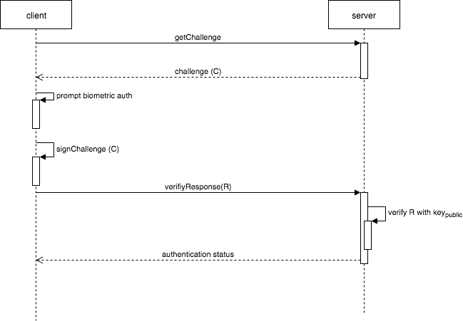

`my.bioMetrics.createSignature` là API tạo ra chuỗi signature từ challenge.
Tham khảo full luồng xác thực người dùng bằng biometrics



- Device sẽ bật chế độ xác thực bằng biometrics để lấy ra private key đã lưu trữ
- Nếu xác thực thành công, private key này sẽ dùng để encrypt challenge để tạo ra 1 chuỗi RSA PKCS#1v1.5 SHA 256 gọi là signature.
- Phía Tiniapp, sau khi có signature này, client gửi signature lên cho server để verify.
- Phía server của Tiniapp, nhận được response từ client, dùng public key để verify response và trả về kết quả authentication cho client
  
**Lưu ý:**

- Việc tạo ra signature đòi hỏi phải có cặp private/public key được tạo ra trước đó bằng JSAPI [my.bioMetrics.createKey](../create-key)

## Quét mã để trải nghiệm

import { QRCode } from '@site/src/components/QRCode';

<QRCode page="pages/component/api/bio-metrics/server/index" />

**_Khả dụng_**: Hỗ trợ từ version 1.96.7 trở lên.

## API Params

| Thuộc tính | Kiểu dữ liệu |Bắt buộc |  Mô tả                                                                                 |
| ---------- | ------------ | ------------ | ------------------------------------------------------------------------ |
| challenge  | String       | √            | Challenge mà server gửi về cho client hoặc chuỗi data mà client muốn gửi lên server để verify                                        |
| content    | String       | √            | Content của popup hiện ra khi xác thực bằng biometrics                                      |
| success    | Function     |              | Callback function khi việc tạo signature thành công                                        |
| fail       | Function     |              | Callback function khi việc tạo signature thất bại                                           |
| complete   | Function     |              | Callback function bất kể thành công hay thất bại                                      |

## Giá trị trong success callback

Khi việc gọi API thành công, framework sẽ trả về payload chứa các thông tin sau

| Thuộc tính | Kiểu dữ liệu | Mô tả                                                                                 |
| ---------- | ------------ | ------------------------------------------------------------------------------------- |
| signature    | String       | Signature được sinh ra                                                              |

### Sample Code

```xml title=index.xml
<view>
  <block-header title="Usage" description="Use Biometrics to authenticate with server" />
  <view class="block-content">
    <view class="page-section-btns">
      <button type="primary" onTap="createKey">Create Key Pair</button>
      <button type="primary" onTap="keyExists">Check Key Exists</button>
      <button type="primary" onTap="deleteKey">Delete Key</button>
    </view>
  </view>
  <view class="block-content">
    <view class="page-section-btns">
      <button type="primary" onTap="createSignature">Generate Signature</button>
    </view>
  </view>
</view>
```

```js title=index.js
Page({
  data: {
    username: 'test@gmail.com',
    password: 'test',
  },  
  createSignature() {
    const payload = `${new Date().getTime()}-${this.data.username}/${this.data.password}`;
    my.bioMetrics.createSignature({
      content: 'Login using Biometrics',
      challenge: payload,
      success: (res) => {
        my.alert({ title: 'Success', content: JSON.stringify(res) });
      },
      fail: (res) => {
        my.alert({ title: 'Fail', content: JSON.stringify(res) });
      },
    });
  },
});
```
