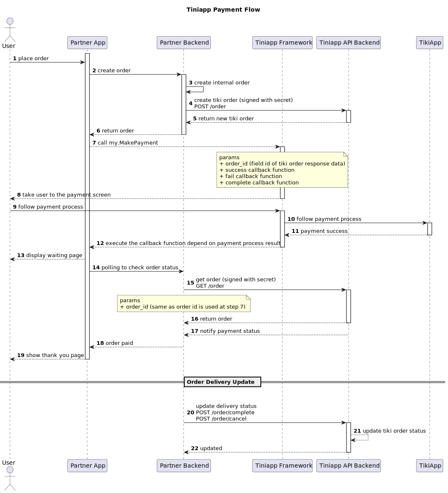

#### Mô hình thanh toán

- **Bước 1**: Khách hàng tạo đơn hàng đặt hàng đối tác.
- **Bước 2**: Đối tác tạo đơn hàng bên phía mình dựa trên đơn hàng của khách cũng như tình hình tồn kho của các mặt hàng.
- **Bước 3**: Đối tác gọi API đến Tiki để tạo đơn hàng phía Tiki. Order ID của đơn hàng được sinh ra; nội dung đơn hàng hoàn toàn do đối tác quyết định.
  ***Quan trọng***: khi đối tác tạo đơn hàng phía Tiki, không nhất thiết nó phải bao gồm toàn bộ SKU mà đối tác nhận đặt từ khách hàng; chỉ cần gồm 1 hay vài SKU để dại diện thanh toán. Điểm mấu chốt là giá trị đơn hàng phải chính xác.
- **Bước 4**: Gọi [my.makePayment](/docs/api/open/make-payment) để phục vụ cho quá trình thanh toán cuả khách hàng.
- **Bước 5**: Sau khi khách thanh toán xong, Tiki sẽ gởi [thông báo] (ipn) đến đối tác.
- **Bước 6**: Backend của đối tác xác thực giao dịch và cập nhật dịch vụ cho khách hàng.
- **Bước 7**: Gọi Api hoàn thành đơn hàng hoặc hủy đơn hàng để kết thúc.
- **Bước 8**: Tiki thanh toán tiền cho đối tác trong trường hợp đơn hàng hoàn thành (giao hàng thành công).

