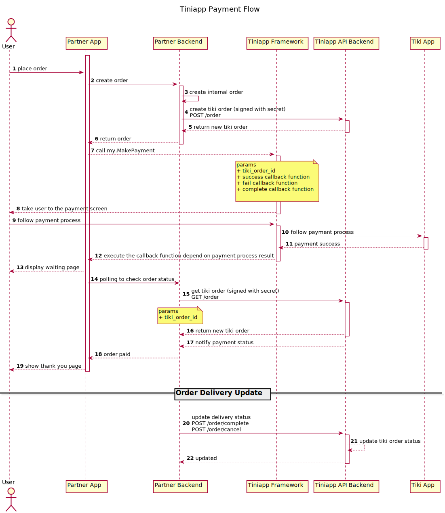

## Giới Thiệu

Khi bạn là một Tini App chạy trên nền tảng của Tiki. Tiki Users sẽ sử dụng dịch vụ payment của Tiki để thanh toán cho sản phẩm/dịch vụ của bạn.

## Tích Hợp Payment Như Thế Nào?

Để sử dụng được tính năng thanh toán thì bạn phải đăng ký trở thành nhà bán trên Tiki để có thể tiếp cận khách hàng. Cụ thể các bước như sau

### Tạo Tài Khoản

1. Trước hết, để là một pháp nhân có thể nhận được tiền thanh toán từ user trên Tiki. Bạn cần phải có account với Seller Center. Đăng ký account Seller Center ở [đây](https://sellercenter.tiki.vn/new/#/register)

1. Sau khi có account trên Seller Center. Bạn cần tạo SKUs để cho các Tini App sử dụng (SKU này có thể sử dụng chung giữa các Tini App hoặc bạn cũng có thể tạo một SKU cho mỗi Tini App của bạn)

1. Đăng nhập vào [Developer Center](https://developers.tiki.vn/apps) và thực hiện các bước theo hướng dẫn để link account Seller Center của bạn vào Developer Center

### Đăng Ký Sản Phẩm

Sản phẩm trên sản TMDT của Tiki và sản phẩm do đối tác cung cấp qua Tini App là hai dòng sản phẩm độc lập. Do đó, bạn cần phải đăng ký sản phẩm của bạn với platform Tini App. Bạn có 2 cách để đăng ký sản phẩm cho Tini App

- Đăng ký sản phẩm sử dụng [Developer Center](https://developers.tiki.vn/apps)
- Dùng SKU bạn đăng ký ở bước trên và gọi API `product_create` [platform API](../open-api/overview) để tạo sản phẩm

### Sơ đồ xử lý

#### Mô hình thanh toán
 - **Bước 1**: Khách hàng tạo đơn hàng
 - **Bước 2**: Đối tác tạo đơn hàng từ phía đối tác
 - **Bước 3**: Đối tác gọi qua Tiki để tạo đơn hàng phía Tiki. (Thông tin đơn hàng hoàn toàn được quyết định phía đối tác)
 - **Bước 4**: Dùng mã đơn hàng của Tiki để gọi [my.makePayment](../../api/payment/make-payment.md)
 - **Bước 5**: Sau khi thanh toán, Tiki sẽ thực hiện hàm callback được đăng ký ở **Bước 4**
 - **Bước 6**: Backend của đối tác xác thực giao dịch và cập nhật dịch vụ cho khách hàng
 - **Bước 7**: Gọi api hoàn thành đơn hàng hoặc hủy đơn hàng để kết thúc


### Tạo đơn hàng
```
/order
```

| Key          | Value                                                                                              |
| ----------   | --------                                                                                           |
| Content-Type | String                                                                                             |
| Method       | Function                                                                                           |
| Domain       | Production:  https://api.tiki.vn/tiniapp-open-api<br /> UAT: https://api.tala.xyz/tiniapp-open-api |

#### HTTP Request

| Attribute    | Type       | Required   | Not null   | Description                                                                                  |
| ----------   | ---------- | ---------- | ---------- | ----------                                                                                   |
| client_id    | string     | Yes        | Yes        | Thông tin tích hợp được cung cấp khi tạo tiniapp [User Profile](../open-api/user-profile.md) |
| customer_id  | string     | Yes        | Yes        | ID người dùng Tiki                                                                           |
| order        | **Order**  | Yes        | Yes        | Thông tin của đơn hàng                                                                       |
| request_time | int64      | Yes        | Yes        | Thời gian tạo yêu cầu, unix time theo milliseconds                                           |
| signature    | string     | Yes        | Yes        | [Chữ ký](./calculate-signature.md)                                                           |

#### Order

| Attribute        | Type        | Required   | Not null   | Description                                                    |
| ----------       | ----------  | ---------- | ---------- | ----------                                                     |
| items            | []**Item**  | Yes        | Yes        | Danh sách sản phẩm                                             |
| shipping_address | **Address** | No         | Yes        | Địa chỉ giao hàng, dùng để hiện thỉ trên trang thanh toán Tiki |
| billing_address  | **Address** | No         | Yes        | Địa chỉ thanh toán                                             |
| extra            | string      | No         | Yes        | Thông tin bổ sung theo định dạng  ***key=value;key=value***    |
| reference_id     | string      | No         | Yes        | ID đơn hàng của đối tác                                        |

#### Item

| Attribute  | Type       | Required   | Not null   | Description                                                 |
| ---------- | ---------- | ---------- | ---------- | ----------                                                  |
| name       | string     | Yes        | Yes        | Tên sản phẩm                                                |
| sku        | string     | Yes        | Yes        | Mã sản phẩm ở bước **Đăng ký sản phẩm**                     |
| quantity   | int64      | Yes        | Yes        | Số lượng sản phẩm                                           |
| price      | int64      | Yes        | Yes        | Giá tiền sản phẩm                                           |
| extra      | string     | No         | Yes        | Thông tin bổ sung theo định dạng  ***key=value;key=value*** |

:::caution

Trong một đơn hàng, các ***items*** khác nhau thì phải có sku khác nhau

:::

#### Address

| Attribute  | Type       | Required   | Not null   | Description   |
| ---------- | ---------- | ---------- | ---------- | ----------    |
| name       | string     | No         | Yes        | Tên           |
| phone      | string     | No         | Yes        | Số điện thoại |
| email      | string     | No         | Yes        | Địa chỉ email |
| street     | string     | No         | Yes        | Địa chỉ       |


Ví dụ về nội dung để tạo chữ ký
```
{"client_id":"lGZ90rObDED2B128","customer_id":"100101547","order":{"billing_address":{"email":"","name":"","phone":"","street":""},"extra":"","items":[{"extra":"id=1","name":"Đại Dịch Tim Không Đập Thình Thịch - Corona : Từ A-Z","price":25600,"quantity":1,"sku":"1139973603662"}],"reference_id":"1","shipping_address":{"email":"long.dang@tiki.vn","name":"Long Đặng","phone":"0901020000","street":"285 Cách Mạng Tháng 8"}},"request_time":1623176376622}
```

Vi dụ về yêu cầu tạo đơn hàng

```
curl --location --request POST 'http://miniapp-open-gateway.dev.tiki.services/order' \
--header 'Content-Type: application/json' \
--data-raw '{"client_id":"lGZ90rObDED2B128","customer_id":"100101547","order":{"items":[{"name":"Đại Dịch Tim Không Đập Thình Thịch - Corona : Từ A-Z","sku":"1139973603662","quantity":1,"price":25600,"extra":"id=1"}],"shipping_address":{"name":"Long Đặng","phone":"0901020000","email":"long.dang@tiki.vn","street":"285 Cách Mạng Tháng 8"},"billing_address":{"name":"","phone":"","email":"","street":""},"extra":"","reference_id":"1"},"request_time":1623176376622,"signature":"4f7d1b9cacf498aba02d911e93132fa91e3d7ad6ef7ed0cfcd02e29837512a53"}'
```

#### HTTP Response

[**Kết quả lỗi**](./error-code.md)

| Attribute   | Type       | Required   | Not null   | Description                               |
| ----------  | ---------- | ---------- | ---------- | ----------                                |
| id          | string     | Yes        | Yes        | ID của đơn hàng                           |
| status      | string     | Yes        | Yes        | Trang thái đơn hàng                       |
| grand_total | int64      | Yes        | Yes        | Tổng số tiền mà người dùng cần thanh toán |

Ví dụ về dữ liệu trả về

```
{
  "data": {
    "order": {
      "id": "83429979421016087",
      "status": "draft",
      "grand_total": 25600
    }
  }
}
```

Sau khi tạo được đơn hàng bạn sẽ có một Order ID, bạn có thể gọi JS API [my.makePayment](../../api/payment/make-payment.md) để mở màn hình thanh toán cho đơn hàng

### Trạng thái đơn hàng

| Status              | Description                                      |
| ----------          | ----------                                       |
| draft               | Đơn hàng chưa được chuyển qua trang thanh toán   |
| waiting_for_payment | Đợi người dùng thanh toán đơn hàng               |
| online_paid         | Người dùng đã thanh toán đơn hàng                |
| canceled            | Đơn hàng đã bị hủy                               |
| completed           | Đơn hàng đã hoàn thành (Đã giao hàng thành công) |

### Nhận Backend IPN Sau Khi Khách Hàng Thanh Toán

Sau khi khách hàng hoàn tất quá trình thanh toán, Tiki platform sẽ gọi backend API của bạn để thông báo về kết quả của giao dịch. Bạn có thể thiết lập URL mà bạn muốn Tiki Platform gọi ở [Developer Center](https://developers.tiki.vn/apps)

**Chú ý**

- Nếu IPN URL của bạn là empty thì Tiki platform sẽ hiểu rằng bạn không muốn nhận IPN.
- IPN có thể được gọi vào backend của bạn nhiều hơn 1 lần cho cùng một order. Bạn cần chú ý xử lý trường hợp này để không xác nhận một đơn hàng nhiều lần.

### Truy Cập Thông Tin Đơn Hàng

Sử dụng Order ID để gọi vào [platform API](../open-api/overview) lấy thông tin đơn hàng

### Thống Kê và Đối Soát

Liên hệ với [Seller Center](https://sellercenter.tiki.vn/new#/user/login) để có thông tin chi tiết. Tham khảo https://hocvien.tiki.vn/

### Tiki Thanh Toán

Liên hệ với [Seller Center](https://sellercenter.tiki.vn/new#/user/login) để có thông tin chi tiết. Tham khảo https://hocvien.tiki.vn/
