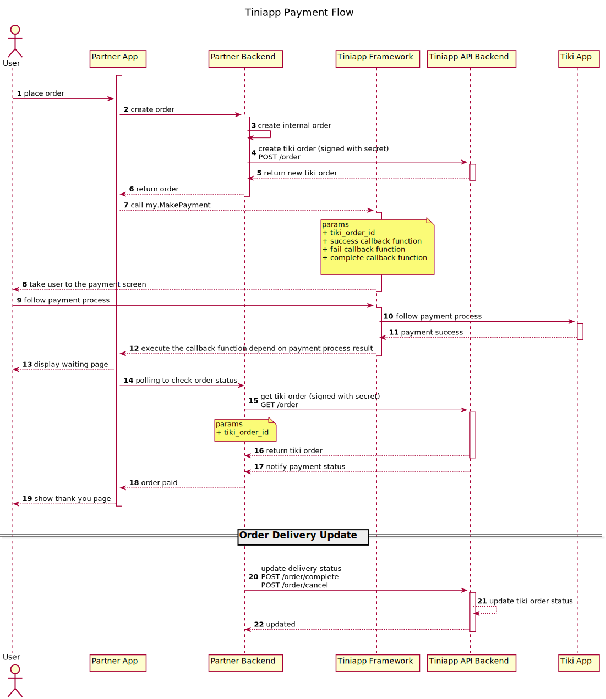

#### Mô hình thanh toán
 - **Bước 1**: Khách hàng tạo đơn hàng
 - **Bước 2**: Đối tác tạo đơn hàng từ phía đối tác
 - **Bước 3**: Đối tác gọi qua Tiki để tạo đơn hàng phía Tiki. (Thông tin đơn hàng hoàn toàn được quyết định phía đối tác)
 - **Bước 4**: Dùng mã đơn hàng của Tiki để gọi [my.makePayment](../../../api/payment/make-payment.md)
 - **Bước 5**: Sau khi người dùng thanh toán, đối tác [xử lý kết quả thành toán](ipn)
 - **Bước 6**: Backend của đối tác xác thực giao dịch và cập nhật dịch vụ cho khách hàng
 - **Bước 7**: Gọi api hoàn thành đơn hàng hoặc hủy đơn hàng để kết thúc

