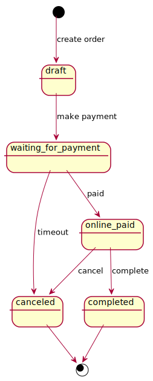

| Status              | Mô tả                                            |
| ----------          | ----------                                       |
| draft               | Đơn hàng chưa được chuyển qua trang thanh toán   |
| waiting_for_payment | Đợi người dùng thanh toán đơn hàng               |
| online_paid         | Người dùng đã thanh toán đơn hàng                |
| canceled            | Đơn hàng đã bị hủy bời người đùng hoặc đối tác   |
| completed           | Đơn hàng đã hoàn thành (Đã giao hàng thành công) |

#### Lưu ý

Ở trạng thái **online_paid**, người dùng vẫn có thể hủy đơn hàng ở trang đơn hàng của Tiki.
Đối tác nên thực hiện business của mình và hoàn thành đơn hàng trong cùng một **_transaction_**

#### Sơ đồ

